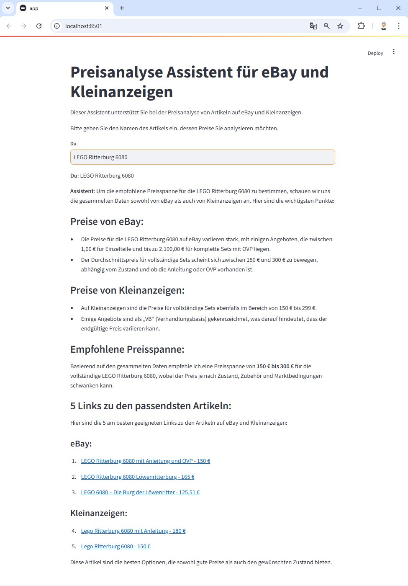

# PriceScoutAI

This is an experimental project that supports researching prices for items on eBay and Kleinanzeigen. 

## Approach

The project combines webscraping with an LLM.

## Prerequisites

This project requires Python 3.10.4 or higher.

The following libraries are used: 

> pip install langchain
> pip install streamlit

## How to use

1. Clone the project 
2. Install the prerequisites
3. Make a copy of `.env-template` to `.env` and specify your OpenAI API key
4. Specify an article name in variable `item_name`
5. On the command 

## Streamlit app

The project provides a [Streamlit](https://streamlit.io/) app that can be run locally.

To run the app, execute the following command on a command prompt:

> streamlit run app.py

## agent.py - How it works

### Step 1

At first, the user has to specify the name of an item he/she is interested.

This is currently done in the variable `item_name` in `agent.py`.

Examples:

- LEGO Ritterburg 6080
- Bosch Rotak 43 Li

### Step 2

When running the script, the websites of eBay and Kleinanzeigen are queried for the article.
The content of the website is scaped for current information on listed articles. 

The extracted data contains:

- Article name
- Article price
- URL to the listing

The information is formatted as a Markdown table such that it can be passed to an LLM.

### Step 3

The information is passed to an LLM (e.g., gpt-4o-mini) with the instruction to analyze the prices and make recommendations for suitable prices when selling an equivalent article.

